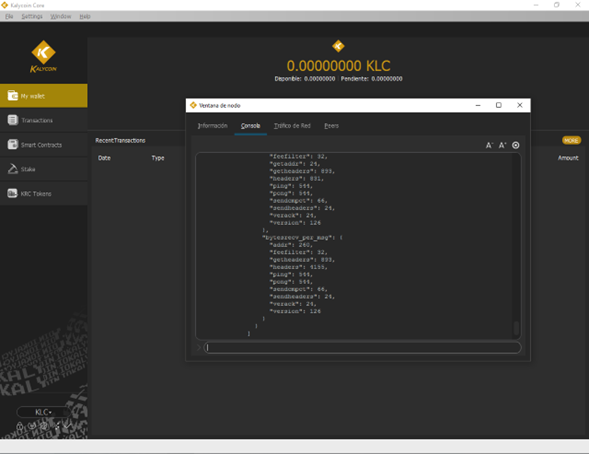

# Adding nodes

Adding nodes on Kalycoin is easy. First let's go to **Window -> Console**

.png>)

Next, let's go to the "console" tab in the debug window and type addnode ipaddress add please remember to replace "ipaddress" with the node IP you want to add.

.png>)

If successfull, you'll see a "null" reply on the console, this means we've added the node successfully

&#x20;****&#x20;

<figure><figcaption></figcaption></figure>

You can always list all nodes your wallet is connected to by typing getpeerinfo on the console tab or by going to the Peers tab.

