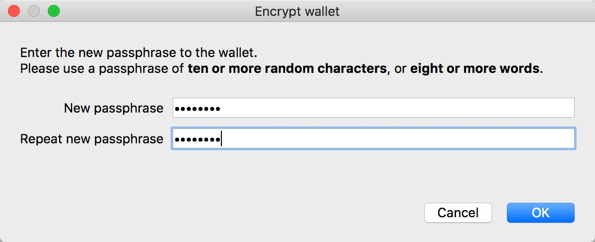

# Encrypt & Unlock Kalycoin Wallet

If you don't know how to deploy a Kalycoin node or don't know how to launch a Kalycoin wallet, please refer to the following instructions:

* For command line users：《[Guidance of Kalycoin Deployment](../Guidance-of-Kalycoin-Deployment-and-RPC-Settings.md)》
* For GUI wallet users(common users)：[https://eco.kalycoin.io/wallet](https://eco.kalycoin.io/wallet)

**Important: After you encrypt the wallet or change your passphrase, please remember to backup your wallet again!!!**

Please do all following things after you successfully installed and run a Kalycoin wallet: 

## Encrypt Wallet

### For command line users

kalycoin-cli command to encrypt wallet：

```
./kalycoin-cli encryptwallet "yourpassphrase"
```

note that `yourpassphrase`is the user defined pass phrase, please remember it or you will lose your KLC.

After encryption, all security related actions such as sending KLC, staking, or dumping private keys will require using the passphrase to unlock the wallet. 

### For GUI wallet users

Choose`Setting-Encrypt Wallet` in the menu, as following:


Create a new passphrase and repeat it. The wallet will restart after encryption.



After restart, there will be a lock icon shown on the bottom of the wallet, which means it is already encrypted and locked：


## Unlock wallet

### For command line users

kalycoin-cli command to unlock wallet：

```
./kalycoin-cli walletpassphrase "yourpassphrase" 300
```

the first argument `yourpassphrase` is the passphrase you set for encryption, while the second is the unlock time in seconds, here 300 seconds or 5 minutes, after which time the wallet will automatically lock itself.

After unlocking, you can send KLC or do other coin security related actions.

If you only want to unlock the wallet for staking only, please use：

```
./kalycoin-cli walletpassphrase "yourpassword" 999999 true
```

The first two arguments are the same, and the 3rd argument `true` means you only want to unlock the wallet for staking only. After doing this, you can start staking, but other coin security related actions like sending KLC or dumping a private key still requre the passphrase to fully unlock your wallet. 

### For GUI wallet users

To fully unlock your wallet, go to “Settings - Unlock wallet”：


and enter the passphrase to unlock wallet. If you choose `For staking only`, it means you only unlock the wallet for staking，but other coin security related actions like sending KLC or dumping a private key are still locked. So please unselect `For staking only` if you want to fully unlock your wallet. To unlock for staking only, you will also need to switch on the Staking button to activate staking as described below.


After unlocking, the lock icon on the bottom of the screen will show an open lock.

For wallet version 0.18.2 and greater, to unlock the wallet for staking only, use the main menu Stake option to show the Staking Page. Click the Staking button to the right and enter the passphrase (leave the checkbox set to "For staking only"):


**NOTE** For staking wallets, it you unlock for staking only using "Settings - Unlock wallet" as shown above, you will still need to select the main menu Stake option to **visit this Stake Page, and click the Staking button to the right to activate staking**. 

After unlocking for staking only, the lock icon will show the hasp slightly opened.

## Change passphrase

### For command line users

command for change passphrase:

```
./kalycoin-cli walletpassphrasechange "oldpassphrase" "newpassphrase"
```

`oldpassphrase` is the current passphrase previously set，and `newpassphrase` is the new passphrase you want set.

### For GUI wallet users

Go to “Setting - Change Passphrase” to change the passphrase：


enter old passphrase and new one to complete modification：


