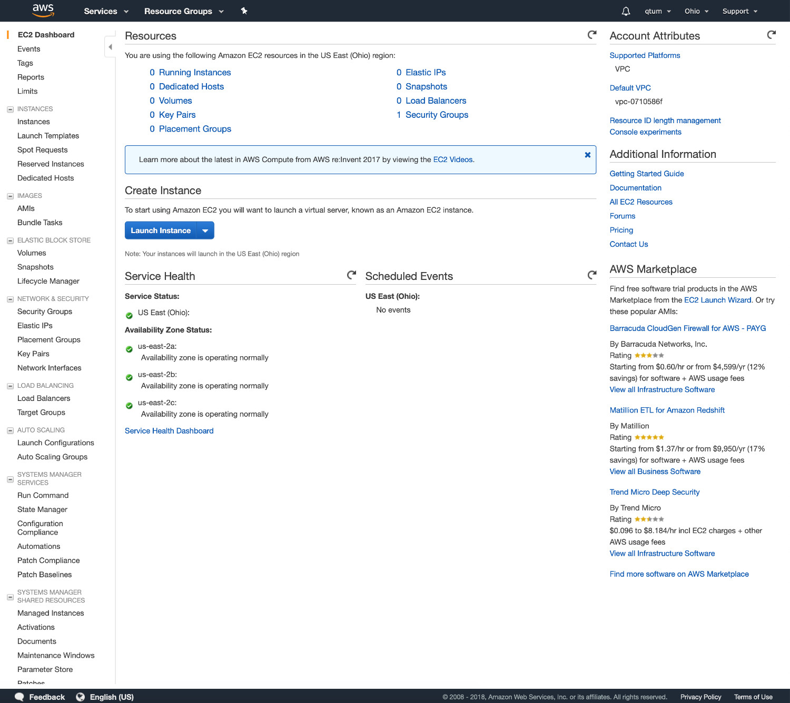
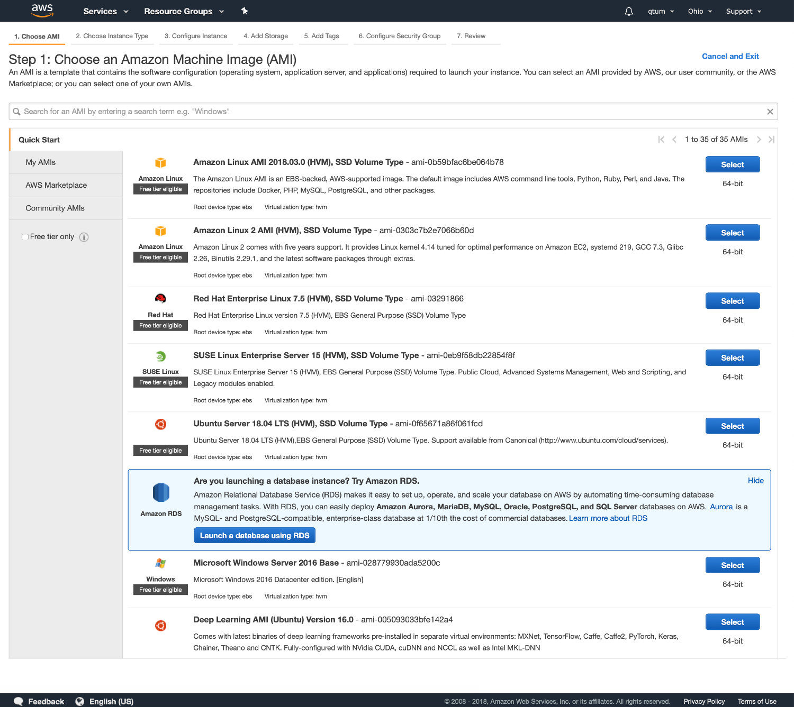
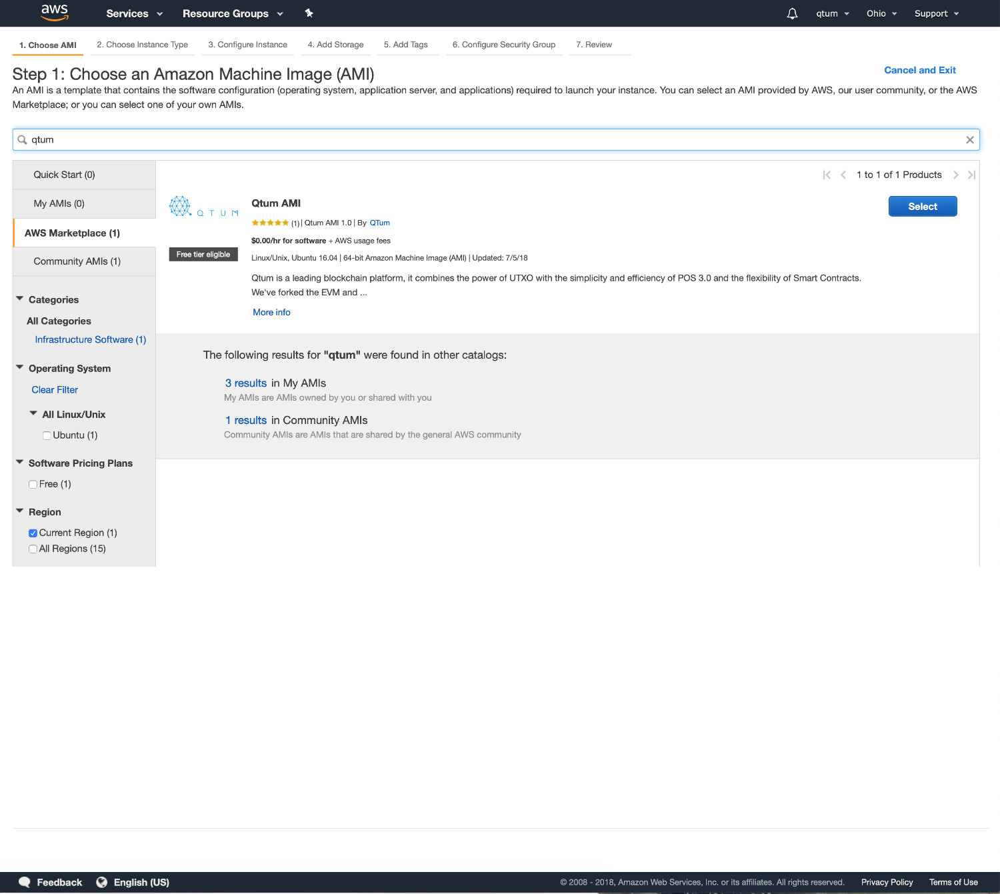
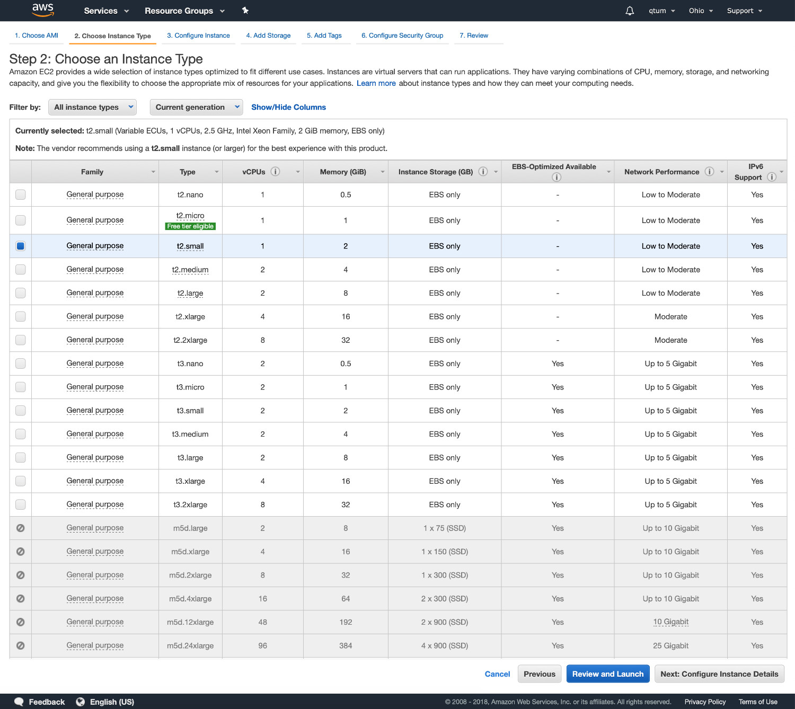
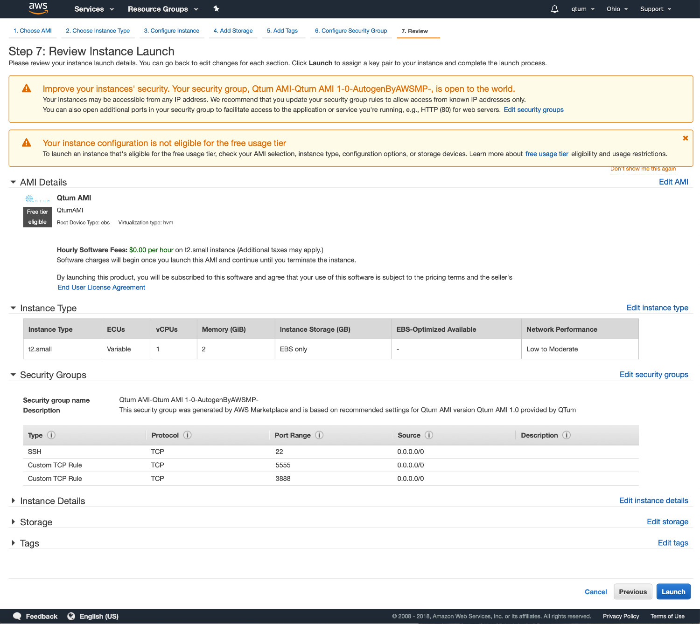
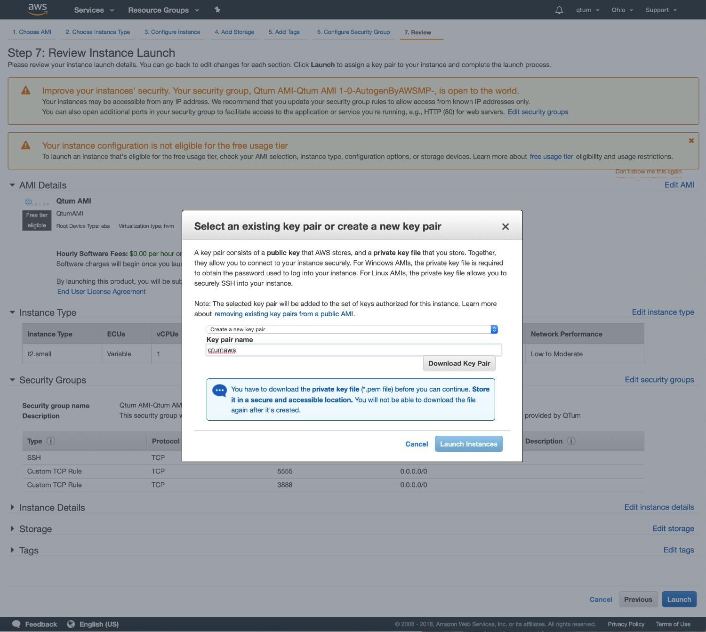
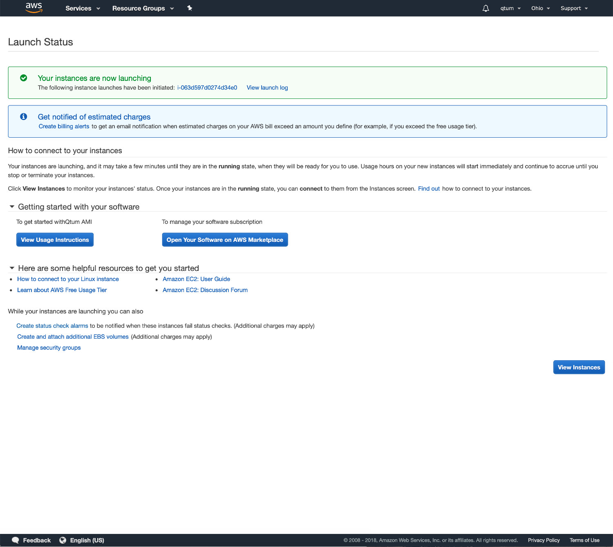
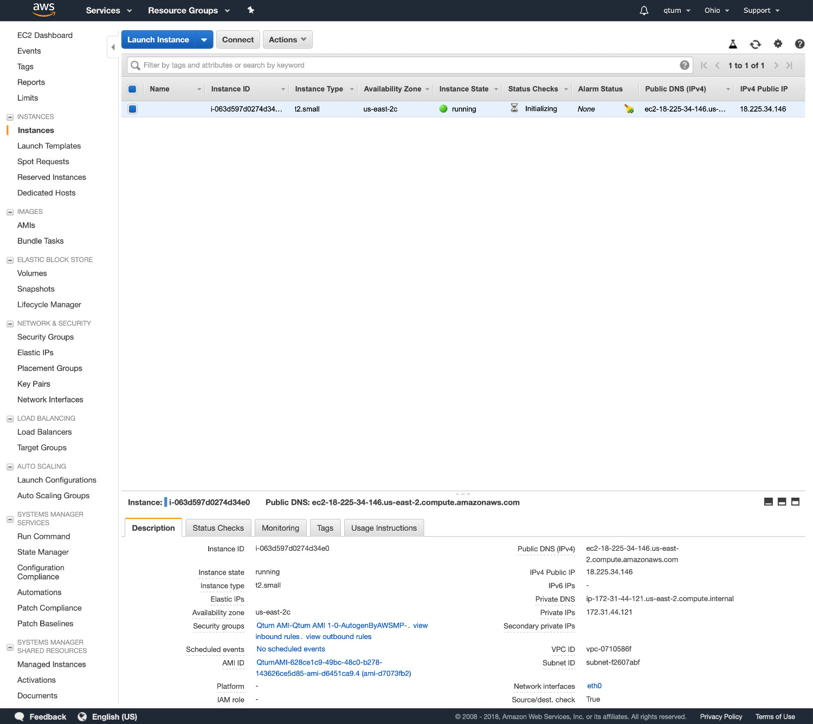
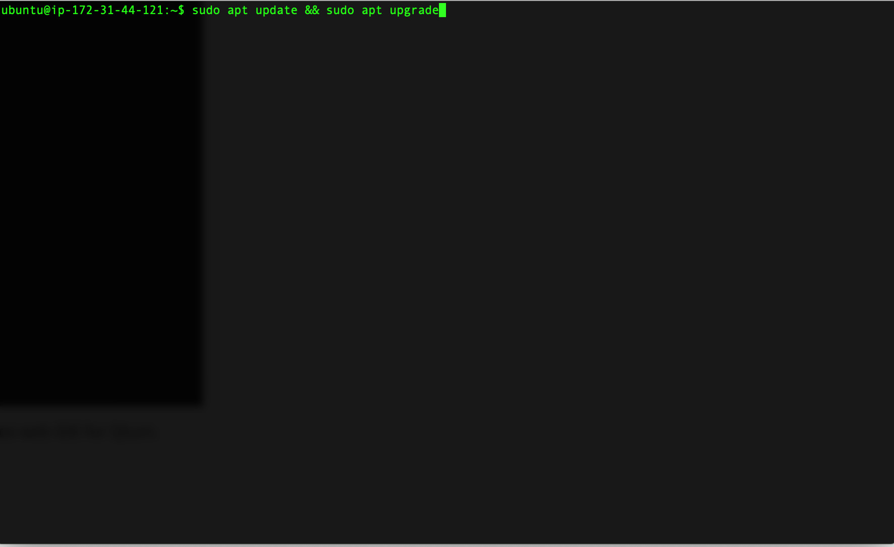
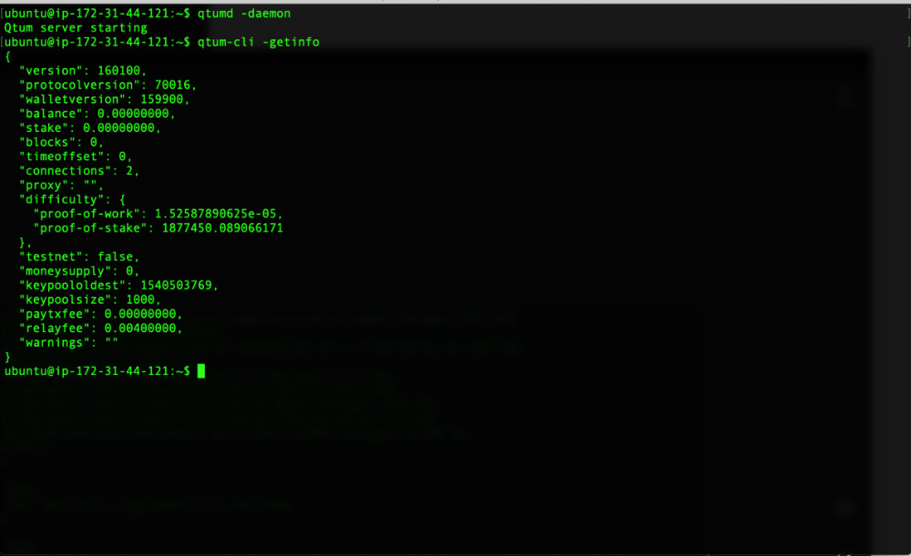

# Kalycoin on AWS ec2

Kalycoin has been available on the **AWS Marketplace**  since early July 2018, this how-to will show how to get started with Kalycoin on AWS.

Running Kalycoin on AWS is incredibly easy, we can deploy a new ec2 instance directly from the marketplace. Let's get started by going to the ec2 dashboard and click on **"Launch Instance"**

By clicking on "Launch instance", you'll be taken to the following screen, where you'll be able to choose an Amazon Machine Image (AMI). 

On the top, we have a search box, let's type **"Kalycoin"** and press enter

This shows the 1st Kalycoin AMI, now all we need to do is click on **"Select"**

Here we're greeted with a list of instance types, each instance has different specs and costs, these vary from region to region. To get a full list of specs+costs, please take a look at the AWS documentation on this matter.  https://aws.amazon.com/ec2/pricing/on-demand/

Next, we'll review details about our instance (disk size, security settings, etc.)

Here we're asked to create a key pair to access this instance, it's a private key file used to access via ssh, this is more secure but you need to be VERY careful with this file, anyone with this file will have complete access to your server!

Please note, the key pair name is "**kalycoinaws**", this will generate a file called **"kalycoinaws.pem.txt"**, we need to rename it to **kalycoinaws.pem** and change the permissions to 0400 by typing `mv kalycoinaws.pem.txt kalycoinaws.pem && chmod 400 kalycoinaws.pem`.

ok, now our instance has been launched, it takes a few seconds to boot. Once done, we can access it via **ssh** with the .pem key we created/downloaded during setup.

To access our instance, let's type ssh -i kalycoinaws.pem ubuntu@**yourinstanceipaddress**

Type "yes" to add the ec2 instance ECDSA key fingerprint to your known_hosts file. 

Upon login, you'll see the following screen, type `ls` to view the files/folders which are already set for you.

The man page (type `man README.man`) shows some basic documentation on how to use this AMI.

It's highly recommended to do a full system update before using Kalycoin, this will update every application and libraries to their latest version including important security patches and bug fixes, this includes Kalycoin which at the time of writing has version 0.16.1 available on the repositories. 

To update everything, we only need to type: `sudo apt update && sudo apt upgrade`

This will synchronize every repository and install any updates available.

Once we finish updating, we can launch the kalycoin daemon by typing kalycoind -daemon 

kalycoin-cli -getinfo shows which version we're running and what's the status of our blockchain sync.

## Security Tips:

AWS ec2 instances are very secure by default, however, there are always additional tweaks we can do to be safer.

1. Change the default username: By default, AWS instances have :"ubuntu" as username, and no password. It's recommended to change this and create your own user and password. Once you've created the new user, delete the default user.
2. Only open the ports you really need to allow access to. By default, this ec2 instance will allow access from **22, 3888 and 5555**.
3. Add your own ssh-key to the file `~./.ssh/authorized_keys` make sure to follow safe procedures on accessing these instances.
