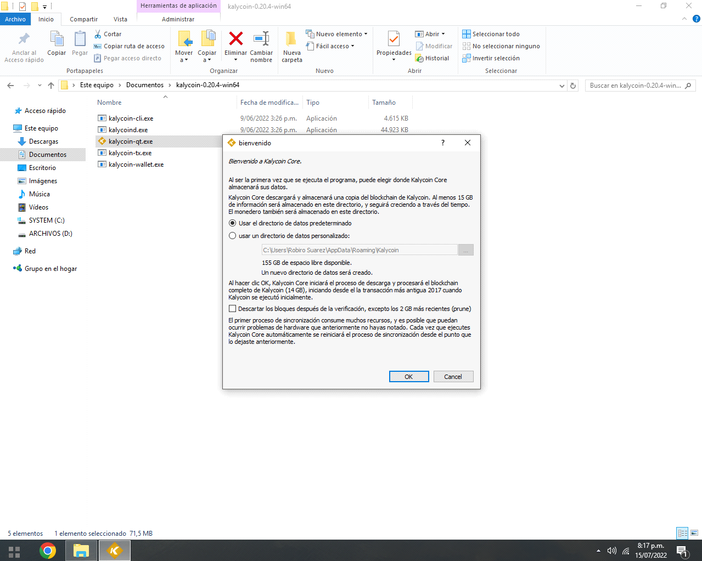
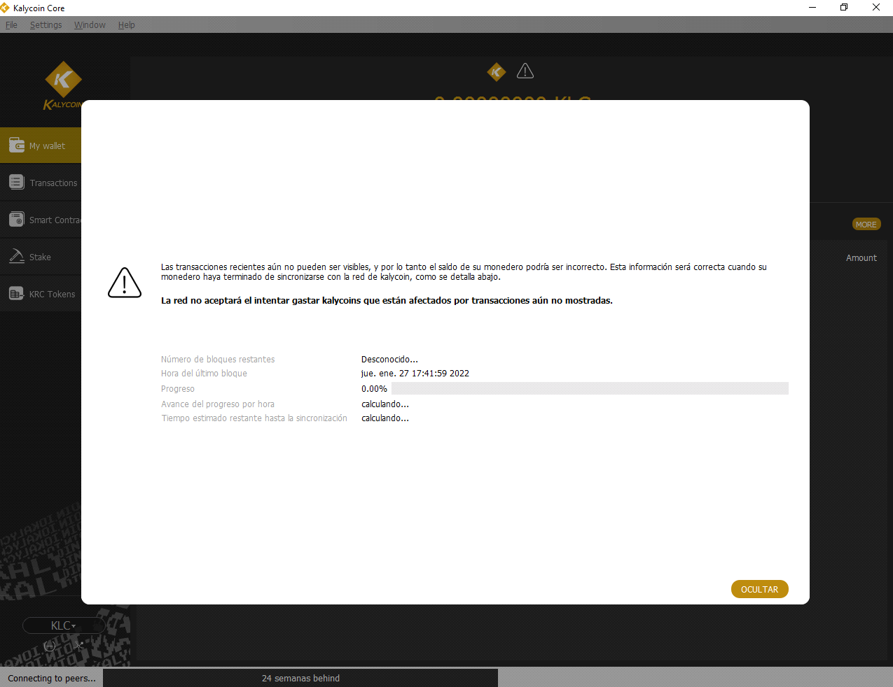
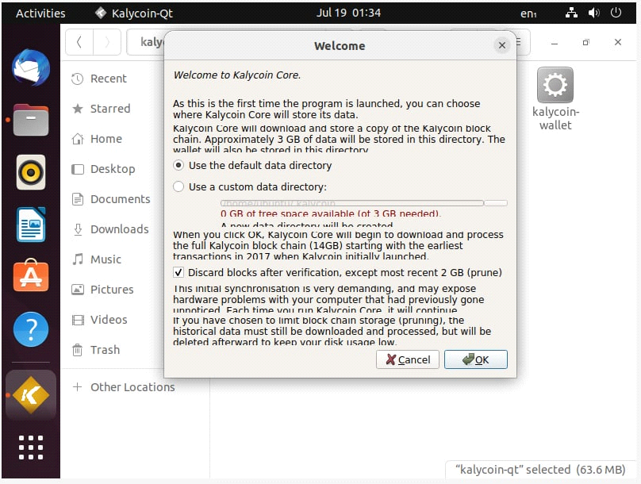
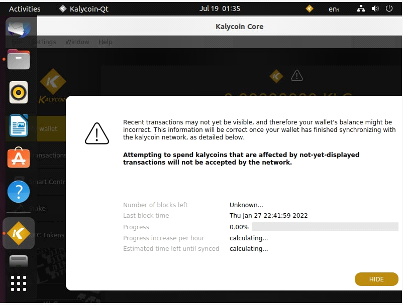

# How to update your Kalycoin wallet

Updating your Kalycoin wallet is quite easy, however, this process changes depending on which operating system you're running, in this document we'll go over the following OS:

•       Windows

•       Linux

Keeping your Kalycoin wallet up-to-date is one of the most important tasks that any staker, holder, developer and any type of Kalycoin user must do.

The process itself is quite simple, however it does vary depending on the operating system you're using.

### **Update Kalycoin on Windows**

Here's a video on how to update your Kalycoin wallet (falta esta informacion) - you can use this document as support for the video.

In this example, we're running a 0.17.6 Kalycoin wallet version on Windows, it is outdated and won't be part of the hardfork, (we need to update ASAP).

However, if we're running the wallet (staking or just left it open), we need to do the following;

•       Close the wallet

•       Download latest Kalycoin wallet version from either one of these links: [https://github.com/KalyCoinProject/KalyCoin/releases](https://github.com/KalyCoinProject/KalyCoin/releases)&#x20;

•       Install the latest wallet using the windows installer

• Once the installer finishes, launch the wallet

•       ¡Voila! you've updated Kalycoin to the latest version available!

### **Update Kalycoin on Linux**

In this example, we're running a 0.17.6 Kalycoin wallet version on Linux, it is outdated and won't be part of the hardfork, (we need to update ASAP).

Now, if you just open the wallet, it'll show this screen where it says the wallet is outdated and that we should update to latest version.

•       Close the wallet

•       If you're using Kalycoin Repo (recommended), all you have to do is either one of these:

•       Debian/Ubuntu/Mint sudo apt update && sudo apt install --upgrade-only Kalycoin

• Once the package manager finishes upgrading, launch the wallet

• Voila! you've updated Kalycoin to the latest version available!
