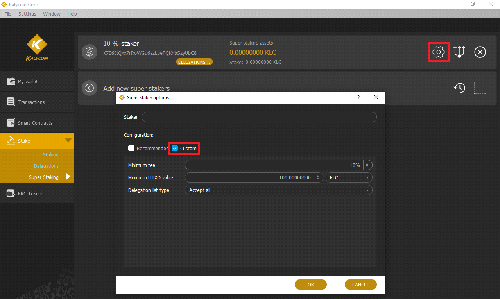
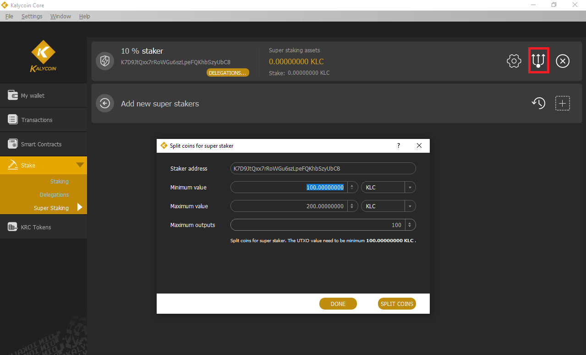
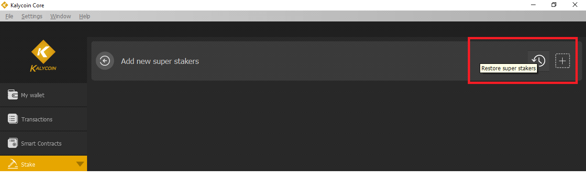

# Offline Staking

* [Delegating Address to Super Staker](https://github.com/KalyCoinProject/documents/blob/main/en/OfflineStaking.md#delegating-address-to-super-staker)
* [Delegating Address Operations](https://github.com/KalyCoinProject/documents/blob/main/en/OfflineStaking.md#delegating-Address-operations)
* [Super Staker Configuration](https://github.com/KalyCoinProject/documents/blob/main/en/OfflineStaking.md#super-staker-configuration)
* [Launching Kalycoin Core as a Super Staker](https://github.com/KalyCoinProject/documents/blob/main/en/OfflineStaking.md#launching-kalycoin-core-as-a-super-staker)
* [kalycoind Super Staker](https://github.com/KalyCoinProject/documents/blob/main/en/OfflineStaking.md#kalycoind-super-staker)
* [Super Staker Operations](https://github.com/KalyCoinProject/documents/blob/main/en/OfflineStaking.md#super-staker-operations)
* [Restore](https://github.com/KalyCoinProject/documents/blob/main/en/OfflineStaking.md#restore)

### **Delegating Address to Super Staker**

Kalycoin Offline Staking allows the address for a non-staking wallet (capable of making the delegation assignment transaction) to be delegated to a Super Staker. Offline Staking is non-custodial: the delegation user keeps full control of their coins and private keys. The address delegation is made via a smart contract transaction from the delegation user's wallet which identifies the delegator's address, the Super Staker address, and the fee the delegator agrees to pay. If the Super Staker accepts this fee, it will begin staking the delegated address UTXOs.

The normal rules for staking UTXOs apply to delegated UTXOs:

·         UTXOs may only be used for staking after they mature (2000 confirmations)

·         The Super Staker will set a minimum size of UTXOs to stake, defaulting to 100 KLC. Delegated UTXOs below this amount will be ignored.

·         It is best practice (for optimum returns) to break UTXOs up into sizes of 100 to 200 KLC each. For users of the Kalycoin Core wallet, this can be easily accomplished with the command line version of splitutxosforaddress, described below.

To make the delegation assignment from the Kalycoin Core wallet, select Stake – Delegations, the Add delegation "+" button in the upper right corner, enter the Staker name (for local reference only), Staker address, Fee you agree to pay, and your Address to be delegated. Leave the default Gas settings alone unless you understand how to set these. The delegation transaction will require at least 0.9  KLC in fees and any excess will be refunded.

Press Confirm and Yes to send the delegation transaction.

Delegation of addresses may also be accomplished using the Kalycoin Electrum wallet, which supports Ledger hardware wallet addresses.

### **Delegating Address Operations**

The Delegate Address transaction is sent to a smart contract which keeps the delegation assignments and will be picked up by the Super Staker there. You can see Delegated Address block reward transactions in the wallet and also with the explorer <mark style="color:blue;">explorer.kalycoin.io</mark>&#x20;

If the wallet is holding  KLC on multiple addresses, the delegation must be made separately for each address (and the transaction fee paid for each address) so it may make sense to consolidate the UTXOs to a single address before splitting UTXOs and delegating. In this case, use coin selection to select and consolidate the addresses. Alternatively, the sendmanywithdupes command could be used to send the entire wallet balance to a new address with appropriately-sized UTXOs.

If the Super Staker accepts a delegation for a particular fee, and then the Super Staker reduces that fee (accepts assignments for a lower fee), to take advantage of that lower fee the user must delegate their address again with the lower fee set.

Delegations from a wallet may be checked on the Stake – Delegations page or with the getdelegationinfoforaddress command.

Backup your wallet to save a copy of the wallet.dat file.  

### **Super Staker Configuration**

The Kalycoin Core wallet provides online Proof of Stake and can be launched and configured to operate as a Super Staker and receive address delegations.

To configure the Kalycoin -Qt wallet for a Super Staker, select Stake – Super Staking and the "+" button to add a new Super Staker. Enter the Staker name (for local reference only, here using the first part of the address and "10" to denote a 10% fee) and select the Staker address using the dropdown.

To operate as a Super Staker, the wallet must be able to check arbitrary addresses (address index), have logs enabled for smart contract operations(log events), be enabled for staking and the single parameter -superstaking sets these three parameters. The first time launching with -superstaking the wallet will rescan the blockchain to rebuild the database to add the address index and log events.

Next, the wallet will prompt to be restarted as a Super Staker using Settings – Options – Enable super staking and OK to restart the wallet.

.png>)

On startup, the wallet will confirm that you want to scan and rebuild the database.

.png>)

The wallet will show "Reindexing blocks on disk…" and "Syncing Headers" while it rebuilds the database, this may take several tens of minutes depending on your computer.

After launching, go back to the Stake – Super Staking page and select the "Configure super staker" button (the gear symbol will now be visible) to compete the Super Staker configuration. Click the Custom box to see the default recommendations (shown below) or customize the setup. Click OK to complete the setup.

The configuration settings are:

·         Minimum fee – the minimum fee offered by delegators that the Staker will accept.

·         Minimum UTXO size – this sets the minimum-sized UTXO that will be evaluated for Proof of Stake consensus by the Staker. Over time, the delegated address should accumulate many small block reward UTXOs and it is inefficient to manage all these small amounts (which should be recombined by the delegator).

·         Delegation list type:

o    Accept all – accept any delegation with the minimum fee or more.

o    Allow list – only accept delegations from specific addresses. Use this mode if operating a Super Staker only for specific addresses, such as for your coins.

o    Exclude list – addresses to exclude from being accepted for staking.

Next, split the UTXOs to valid amounts for committing stakes by the Super Staker. The UTXOs must be a minimum amount of 100 KLC. On the Super staker page select the split coins button (trident icon) and use the default values or make adjustments, but no UTXOs under 100 KLC will be used for staking.

You can also split UTXOs with the splitutxosforaddress command, which can be used for delegated addresses as well. To split the UTXOs between a minimum and maximum value, enter the command:

splitutxosforaddress "address" minValue maxValue ( maxOutputs )

For example, if a wallet held UTXOs of 40, 50, 60, 70, and 800  KLC, to split these into UTXOs of a minimum 100 and maximum 200 would use the command:

{

&#x20; "txid": "197a199c3ac9dd8df574ca77da15c5da31db3f7101e2108638a3b2f94248b9f7",

&#x20; "selected": "1020.00",

&#x20; "splited": "1020.00"

}

For this example, the total input was 1,020  KLC, and the split was 9 UTXOs of 100.0 and one of 119.99566, the wallet sending a "transaction to self" and paying a fee of 0.00434  KLC.

Larger wallets may need to adjust the "Maximum outputs" number for splitting. In the example above with the "Maximum outputs" field set to the default value of 100, the split operation will split giving 100  KLC (minimum size) x 100 (Maximum outputs) = 10,000 of UTXO value. For addresses holding more value the "Maximum output" field could be set higher, to 500, or 1000. With the "Maximum outputs" field set to 1000 it can split up to 100,000 in UTXO value. Even bigger addresses could just repeat this split command set for 1000 Maximum outputs until the Split operation reports back that it has selected and split 0 coins.

Previously you could use the sendmanywithdupes command but that took significant formatting and operationally you would want to send to a new address. Of course, after either of these commands, the UTXOs must mature for 2000 confirmations before they can be used for staking.

### **Launching Kalycoin Core as a Super Staker**

The above steps show the transition from a default installation Kalycoin Core wallet to a Super Staker. The wallet may also be initially launched as a Super Staker to shorten the steps. In this case, the initial blockchain sync is accompanied by building the database for address index and log events (as discussed above) so the wallet is all ready for Super Staking.

The Kalycoin Core wallet may be launched as a Super Staker with Kalycoin -Qt using Settings - Options – Main – Enable super staking steps as shown above, or directly through the command line using the -superstaking parameter (testnet shown here).

### (Imagen restante)

This command for the default program directory on Windows would be:

Kalycoin -qt -testnet -superstaking

### (Imagen restante)

When the wallet launches and syncs the blockchain (creating address index and log events) it is all ready to add Super Stakers. Configure a Super Staker and then enable super staking on Settings – Options – Main – set "Enable super staking" and the Super Staker will be ready.

### **Kalycoin d Super Staker**

Any address in a Kalycoin Core wallet running as a Super Staker may receive delegated addresses and operate as an individual Super Staker. The Desktop GUI wallet Kalycoin -Qt allows configuration of multiple Super Staker addresses with different fees and minimum UTXO sizes. The daemon/server wallet Kalycoin d runs all its Super Staker addresses using the same fee and minimum UTXO size. If a variation is needed across multiple Super Staker addresses with Kalycoin d, it is possible to set these up with the Kalycoin -Qt wallet and simply transfer the wallet.dat file to Kalycoin d.

The following setup for Kalycoin d shows the use of a single Super Staker address.

After installing Kalycoin d, launch with the following parameters (testnet shown):

./ Kalycoin d -testnet -superstaking

Optional parameters may be added to change the default fee (of 10%) and minimum UTXO value (of 100  KLC), for example as:

\-stakingminfee=12 -stakingminutxovalue=120

Once the wallet syncs the blockchain, get an address to send some  KLC. This will be the Super Staker address. Use the command:

./ Kalycoin -cli -testnet getnewaddress "legacy"

Then send 1,300  KLC to this address.

### (Imagen restante)

This 1,300  KLC will arrive in a single UTXO, which must be split for the Super Staker operation. Use the splitutxosforaddress command with the default 100 minimum size and 200 maximum size:

./ KLC -cli -testnet splitutxosforaddress "qdMp2BNpwL6ZmMEQHfLV5wGNVgmPCuzd7d" 100 200

### (Imagen restante)

The command response shows that 1,300 KLC were selected for splitting, in this case splitting into 12 UTXOs which can be seen with the txid on the Explorer.

At this point, the Kalycoin d wallet is ready for Super Staker operation with address qdMp2BNpwL6ZmMEQHfLV5wGNVgmPCuzd7d, and delegations can be monitored using the command:

getdelegationsforstaker "qdMp2BNpwL6ZmMEQHfLV5wGNVgmPCuzd7d"

### **Super Staker Operations**

The Super Staker must hold UTXOs to commit to stakes for the delegated UTXOs it is staking. The number of UTXOs (of minimum size 100 KLC) is based on Delegated Weight as a percent of overall Network Weight, and good values are 30 UTXOs for staking 1% of Network Weight, 50 UTXOs for 2.0%, 100 UTXOs for 5% and 160 UTXOs for staking 10% of overall Network Weight.

Super Stakers should monitor their Wallet weight (UTXO weight minus amount currently staking) and add UTXOs if it drops below several thousand.

Make a backup of the wallet (save the wallet.dat file) after changes in the offline staking configuration such as adding a Super Staker or adding a delegation, because the offline staking configuration is saved in the wallet.dat file. If the backup wallet.dat file is lost the configuration may also be restored with Recovery as shown below.

Delegations to a Super Staker may be checked using the "Delegations…" button on the Super Staker page or with the getdelegationsforstaker command.

### **Restore**

Normally delegation and Super Staker configuration are stored in the wallet.dat file. If there are problems with the wallet.dat file the delegation information and super staker information may be recovered using the Restore button on the delegation and Super Staker pages. In this case, the wallet will rescan the "state" contract memory for offline staking transactions for the appropriate addresses.

