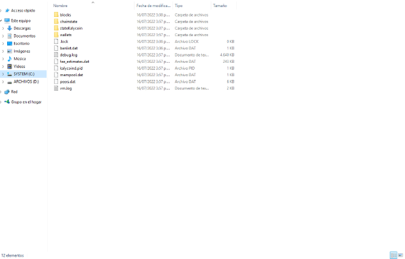

# Wallet recovery with salvagewallet

## **Recovery wallet data with salvagewallet**

This is a very helpful method to recovery your wallet data. It can fix following issues.

·         Incorrect balance

·         Broken wallet

·         Wallet launching issue

**PLEASE make sure backup your wallet before below operations. These operations may break your wallet.**

### **Windows wallet tutorial**

Let's take Windows 10 as example. Other windows are similar.

Firstly please find the shortcut of _Kalycoin -Qt_. It's on the desktop or the start menu. Copy it to the desktop.

Right click on the short cut, click on **Properties** and click on **Shortcut**. Then add --salvagewallet to the end of **Target**.

Click on **OK**. The dialogue will be closed.

Now double click on the shortcut. The wallet will launch and reindex blocks.

We can have a look at the data menu of Kalycoin. Open menu %APPDATA%\ Kalycoin. **Please be careful and don't remove or change any content under this menu except you are aware of them.**

Now the old wallet has been backed up to wallet.1516172743.bak. The wallet is using the new wallet.dat file. It contains all private keys with brand new data.

After the above steps, it's better to remove the shortcut on the desktop in order not to reindex your wallet next time.
